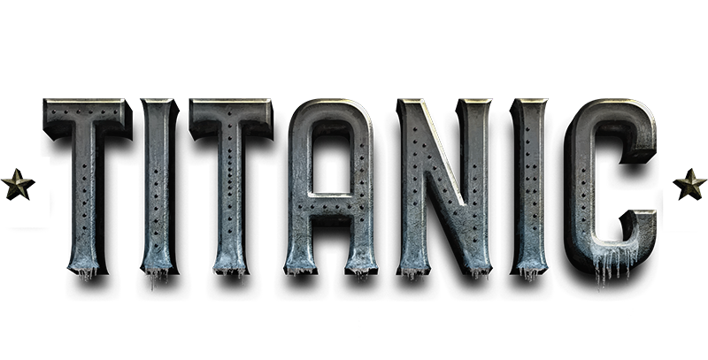

    

___

[Sobre o projeto](#Sobre-o-projeto) 
[Métodos](#Métodos-utilizados) 
[Arquitetura](#Arquitetura) 
[Ferramentas](#Ferramentas) 
[Música](#Música) 
[Bibliografias](#Referências-Bibliográfica) 
___
# Sobre o projeto
Objeto de estudo são os dados do Titanic, com o objetivo de prever a quantidade de sobreviventes.

# Métodos utilizados:
* CRISP_DM - Cross Industry Standard Process for Data Mining.
* Chart Visualization

# Arquitetura:
Em desenvolvimento

___
# Ferramentas:
## Bibliotecas:
- pandas
- matplotlib
## Modelos de classificação:
- Scikit-Learn
- KNN
- Árvore de Decisão
- Regressão Logística
- Matriz de Confusão
- Acurácia
- Precisão
- Recall

# Música:
* https://www.youtube.com/watch?v=v1mQT1u_45I
___

# Referências:
* https://pandas.pydata.org
* https://www.datascience-pm.com/crisp-dm-2/
* https://pandas.pydata.org/docs/user_guide/visualization.html
* https://seaborn.pydata.org/generated/seaborn.pairplot.html
* https://www.kaggle.com/competitions/titanic/data
* https://scikit-learn.org/stable/modules/generated/sklearn.neighbors.KNeighborsClassifier.html#sklearn.neighbors.KNeighborsClassifier
* https://scikit-learn.org/stable/modules/tree.html#classification
* https://pandas.pydata.org/docs/reference/api/pandas.DataFrame.dropna.html
* https://scikit-learn.org/stable/modules/generated/sklearn.linear_model.LogisticRegression.html#sklearn.linear_model.LogisticRegression
* https://scikit-learn.org/stable/modules/generated/sklearn.metrics.confusion_matrix.html#sklearn.metrics.confusion_matrix
* https://scikit-learn.org/stable/modules/generated/sklearn.metrics.accuracy_score.html#sklearn.metrics.accuracy_score
* https://scikit-learn.org/stable/modules/generated/sklearn.metrics.precision_score.html#sklearn.metrics.precision_score
* https://scikit-learn.org/stable/modules/generated/sklearn.metrics.recall_score.html#sklearn.metrics.recall_score

___
# Contato:

[ **Nilva Pires**](https://github.com/nilva2020) 
   

___
Developer - 2023 - Nilva Pires - DataScience.
