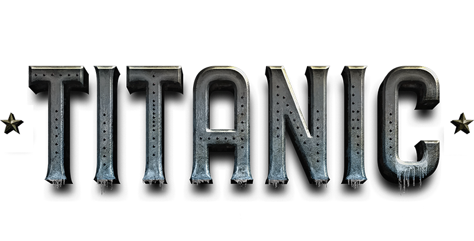

    

___

[Sobre o projeto](#Sobre-o-projeto) 
[Métodos](#Métodos-utilizados) 
[Arquitetura](#Arquitetura) 
[Ferramentas](#Ferramentas) 
[Música](#Música) 
[Bibliografias](#Referências-Bibliográfica) 
___
# Sobre o projeto
Objeto de estudo são os dados do Titanic

### Versão:

# Métodos utilizados:
* CRISP_DM - Cross Industry Standard Process for Data Mining.

    

___

# Arquitetura:

___
# Ferramentas:

# Música:
* https://www.youtube.com/watch?v=v1mQT1u_45I
___

# Referências:
* https://pandas.pydata.org
* https://www.datascience-pm.com/crisp-dm-2/

___
# Contato:

___
Development - 2023 - Nilva Pires - DataScience.
